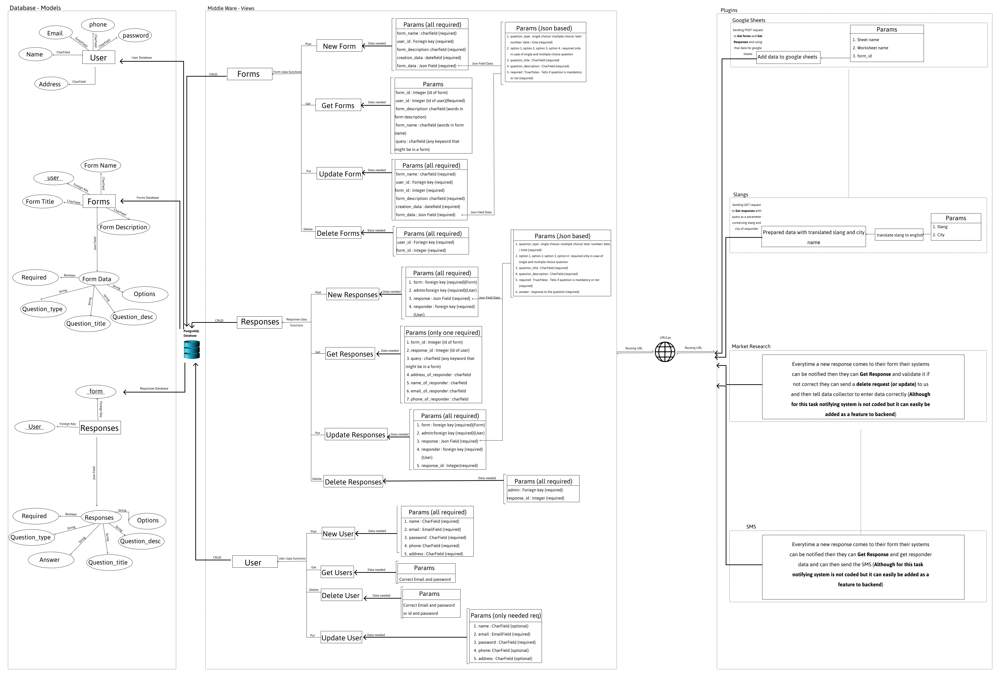

# <b> Atlan Backend Task <b>


<br>

## What is in this document
 - [Problem Statement](#problemstatement)
 - [My Approach](#approach)
 - [Database](#database)
 - [MiddleWare API](#middleware)

# <a id="problemstatement"> </a> Problem Statement 
About the Product:
<b>Collect</b> is a data collection platform that is being used by customers in 50+ countries in over 250 organizations and has powered data collection for over 11 million responses. Its features include team management, multilingual forms, and offline data collection. Our customers use Collect to power their most critical activities — from governments delivering vaccines to small business owners managing their daily inventory, to a zoo monitoring a rare wildlife species.

<b>Problem Statement:</b>

The lifecycle of data collection via Collect does not end with the submission of a response. There is usually some post-submission business logic that Collect needs to support over time. Some real-life examples -


 - One of our clients wanted to search for slangs (in local language) for an answer to a text question on the basis of cities (which was the answer to a different MCQ question)

 - A market research agency wanted to validate responses coming in against a set of business rules (eg. monthly savings cannot be more than monthly income) and send the response back to the data collector to fix it when the rules generate a flag 

 - A very common need for organizations is wanting all their data onto Google Sheets, wherein they could connect their CRM, and also generate graphs and charts offered by Sheets out of the box. In such cases, each response to the form becomes a row in the sheet, and questions in the form become columns. 

 - A recent client partner wanted us to send an SMS to the customer whose details are collected in the response as soon as the ingestion was complete reliably. The content of the SMS consists of details of the customer, which were a part of the answers in the response. This customer was supposed to use this as a “receipt” for them having participated in the exercise.


<b>Further details</b>

We preempt that with time, more similar use cases will arise, with different “actions” being required once the response hits the primary store/database. We want to solve this problem in such a way that <b>each new use case can just be “plugged in” </b> and does not need an overhaul on the backend. Imagine this as a whole ecosystem for integrations. We want to optimize for 
<b>latency and having a unified interface </b> acting as a middleman.


Design a sample schematic for how you would store forms (with questions) and responses (with answers) in the Collect data store. Forms, Questions, Responses and Answers each will have relevant metadata. Design and implement a solution for the Google Sheets use case and choose any one of the others to keep in mind how we want to solve this problem in a plug-n-play fashion. Make fair assumptions wherever necessary.

Eventual consistency is what the clients expect as an outcome of this feature, making sure no responses get missed in the journey. Do keep in mind that this solution <b>must be failsafe,</b> should eventually recover from circumstances like power/internet/service outages, and should <b> scale to cases like millions of responses</b> across hundreds of forms for an organization. 


There are points for details on how would you benchmark, set up logs, monitor for system health, and alerts for when the system health is affected for both the cloud as well as bare-metal.<b> Read up on if there are limitations on the third party </b>( Google sheets in this case ) too, a good solution keeps in mind that too.

The deliverable upon completion of the task is a zip file containing
 - design specification
 - a brief but comprehensive explanation for the various approaches you can think of to solve for this and why you went ahead with the approach that you did - i.e a pro/con analysis 
 - the codebase

It is advised to use a version control system for the codebase, but please avoid creating public repositories on Github/Bitbucket et al.


# <a id="approach"></a> My Approach



Please expand this picture to see the details of the approach in an image format.

<br>
I have created an API that will act as a middleman and perform all CRUD operations on the database. All other operations can be easily plugged in by pasting paths to functions in URLS.py file and will perform all CRUD operations through the middleman thus ensuring <b>latency and unified design</b>

# <a id="database"></a>Database Design

I have used PostgreSQL database as it is an open source object-relational database. Or in simple layman terms I can store both table like data and JSON field like data in one database instead of using two like MySQL or MongoDB

I have created 3 models

- <a href= "#user_database"> User</a>
- <a href= "#form_database">Form</a>
- <a href= "#response_database">Response</a>

## <a id= "user_database"></a>User model

It contains following fields:
 - name - CharField (contains name of the user)
 - password - CharField (contains password of the user)
 - email - EmailField (contains email of the user)
 - phone - CharField (contains phone number of the user)
 - address - CharField (contains address of the user [address,city,state,country])


## <a id= "form_database"></a> Form model

It contains following fields:
 - form_name - CharField (contains name of the form)
 - form_description - CharField (contains description of the form)
 - form_data - JsonField (contains questions/options/images etc of the form)
 - user - ForeignKey (contains user who created the form)

 Form data is a JSON field containing following data : 

    - question_title - CharField (contains question title [required])
    - question_type - CharField (contains question type [required][eg : single choice, multiple choice, text, number, date, time, file])
    - question_description - CharField (contains question description [required])
    - option 1 - CharField (option 1 for single choice and multiple choice questions)
    - option 2 - CharField (option 2 for single choice and multiple choice questions)
    - option 3 - CharField (option 3 for single choice and multiple choice questions)
    - option 4 - CharField (option 4 for single choice and multiple choice questions)
    - required - BooleanField (contains whether the question is required or not [required])
    - help_image - ImageField (contains help image for the question[optional])

## <a id= "response_database"></a> Response model

It contains following fields:
 - form - ForeignKey (contains form to which the response belongs)
 - response - JsonField (contains answers/questions/question_type/help_image etc. of the response)
 - user - ForeignKey (contains user who created the response [From User Database] )
 - admin - ForeignKey (contains admin who created the response[From User Database] )

  Response is a JSON field containing following data : 

    - question_title - CharField (contains question title [required])
    - question_type - CharField (contains question type [required][eg : single choice, multiple choice, text, number, date, time, file])
    - question_description - CharField (contains question description [required])
    - option 1 - CharField (option 1 for single choice and multiple choice questions)
    - option 2 - CharField (option 2 for single choice and multiple choice questions)
    - option 3 - CharField (option 3 for single choice and multiple choice questions)
    - option 4 - CharField (option 4 for single choice and multiple choice questions)
    - required - BooleanField (contains whether the question is required or not [required])
    - help_image - ImageField (contains help image for the question[optional])
    - answer - CharField (contains answer of the question as answered by a user [required])

# <a id="middleware"></a> MiddleWare API

<b>Base URL : </b>http://127.0.0.1:8000/

## User Methods

This API will perform all CRUD operations on User Model and has following methods:

  - <a href="#create_user">Create User</a> 
  - <a href="#get_user">Get User</a>
  - <a href="#update_user">Update User</a>
  - <a href="#delete_user">Delete User</a>


### <a id = "create_user"></a> 1. Create User
 
   url : /new_user

   request : POST

   Body : 

  ```json
    {
        "name" : "John Doe",
        "password" : "JohnDoe123",
        "email" : "johndoe@gmail.com",
        "phone" : "1234567890",
        "address" : "123 fake address, NewYork, USA"
    }
  ```
  Response : 

  Status code = 201
  ```json
      {
          "data": {
              "id": 1,
              "name": "John Doe",
              "email": "johndoe@gmail.com",
              "password": "JohnDoe123",
              "phone": "1234567890",
              "address": "123 fake address, NewYork, USA"
          }
      }
  ```
  Status code = 400
  ```json
      {
          "error": "User already exists"
      }
  ```
  Status code = 400
  ```json
      {
          "error": "Name, Email, password, phone, address something is missing"
      }
  ```

  Status code = 405
  ```json
      {
          "detail": "Method \"<ANY REQUEST EXCEPT POST>\" not allowed."
      }
  ```

###  <a id = "get_user"></a> 2. Get User
 
   url : /get_user?email=email&password=password

   request : GET

   Body : 

  ```
    get_user?email=johndoe@gmail.com&password=JohnDoe123
  ```
  Response : 

  Status code = 200
  ```json
      {
          "data": {
              "id": 1,
              "name": "John Doe",
              "email": "johndoe@gmail.com",
              "password": "JohnDoe123",
              "phone": "1234567890",
              "address": "123 fake address, NewYork, USA"
          }
      }
  ```
  Status code = 400
  ```json
      {
          "error": "Password is incorrect"
      }
  ```
  Status code = 400
  ```json
      {
          "error": "User does not exists"
      }
  ```
 Status code = 400
  ```json
      {
          "error": "Email or password is missing"
      }
  ```
  Status code = 405
  ```json
      {
          "detail": "Method \"<ANY REQUEST EXCEPT GET>\" not allowed."
      }
  ```


###  <a id = "update_user"></a> 3. Update User
 
   url : /update_user

   request : PUT

   Body : 

  ```json
    {
        "name" : "Doe John",
        "password" : "JohnDoe123",
        "email" : "johndoe@gmail.com",
        "phone" : "1234567890",
        "address" : "123 fake address, NewYork, USA"
    } 
  ```
  Response : 

  Status code = 200
  ```json
      {
          "message": "User updated successfully"
      }
  ```
  Status code = 400
  ```json
      {
          "error": "User does not exists or is Unauthorized"
      }
  ```
  Status code = 400
  ```json
      {
          "error": "Email is missing"
      }
  ```
  Status code = 405
  ```json
      {
          "detail": "Method \"<ANY REQUEST EXCEPT GET>\" not allowed."
      }
  ```


###  <a id = "delete_user"></a> 4. Delete User
 
   url : /delete_user

   request : DELETE

   Method 1 : By email and Password

   Body : 

  ```json
    {
        "password" : "JohnDoe123",
        "email" : "johndoe@gmail.com",
    } 
  ```

  Method 2 : By User id and Password

   Body : 

  ```json
    {
        "id":1,
        "password" : "JohnDoe123"
    } 
  ```

  Response : 

  Status code = 200
  ```json
      {
          "message": "User deleted successfully"
      }
  ```
  Status code = 400
  ```json
     {
         "error": "Email or id is missing"
     }
  ```
  Status code = 400
  ```json
      {
        "error":"User does not exists"
      }
  ```
  Status code = 405
  ```json
      {
          "detail": "Method \"<ANY REQUEST EXCEPT GET>\" not allowed."
      }
  ```


## Form Methods

This API will perform all CRUD operations on Form Model and has following methods:

  - <a href="#create_form">Create Form</a> 
  - <a href="#get_form">Get Form</a>
  - <a href="#update_form">Update Form</a>
  - <a href="#delete_form">Delete Form</a>


### <a id = "create_form"></a> 1. Create Form
 
   url : /new_form

   request : POST

   Body : 

  ```json
    {
        "user_id" : 1,
        "form_name" : "Test Form",
        "form_description":"This is a form description",
        "form_data" : [
            {
                "question_title" : "This is a sample question 1",
                "question_type" : "Single Choice",
                "question_description" : "This is question description",
                "option 1" : "option 1",
                "option 2" : "option 2",
                "option 3" : "option 3",
                "option 4" : "option 4",
                "required" : "True",
                "help_image" : "https://i.pinimg.com/originals/d9/4a/49/d94a495eca526d82ebbe0640aea413a9.jpg"
            },
            {
                "question_title" : "This is a sample question 2",
                "question_type" : "Multiple Choice",
                "question_description" : "This is question description",
                "option 1" : "option 1",
                "option 2" : "option 2",
                "option 3" : "option 3",
                "option 4" : "option 4",
                "required" : "False"
            },
            {
                "question_title" : "This is a sample question 3",
                "question_type" : "text",
                "question_description" : "This is question description",
                "required" : "False"
            },
            {
                "question_title" : "This is a sample question 4",
                "question_type" : "number",
                "question_description" : "This is question description",
                "required" : "False"
            },
            {
                "question_title" : "This is a sample question 5",
                "question_type" : "date",
                "question_description" : "This is question description",
                "required" : "True"
            },
            {
                "question_title" : "This is a sample question 6",
                "question_type" : "time",
                "question_description" : "This is question description",
                "required" : "True"
            },
            {
                "question_title" : "This is a sample question 7",
                "question_type" : "file",
                "question_description" : "This is question description",
                "required" : "False"
            }
        ]

    }
  ```
  Response : 

  Status code = 201
  ```json
      {
          "data": {
              "id": 1,
              "form_name": "Test Form",
              "form_description": "This is a form description",
              "form_data": "[{\"question_title\": \"This is a sample question 1\", \"question_type\": \"Single Choice\", \"question_description\": \"This is question description\", \"option 1\": \"option 1\", \"option 2\": \"option 2\", \"option 3\": \"option 3\", \"option 4\": \"option 4\", \"required\": \"False\", \"help_image\": \"https://i.pinimg.com/originals/d9/4a/49/d94a495eca526d82ebbe0640aea413a9.jpg\"}, {\"question_title\": \"This is a sample question 1\", \"question_type\": \"Multiple Choice\", \"question_description\": \"This is question description\", \"option 1\": \"option 1\", \"option 2\": \"option 2\", \"option 3\": \"option 3\", \"option 4\": \"option 4\", \"help_image\": \"https://i.pinimg.com/originals/d9/4a/49/d94a495eca526d82ebbe0640aea413a9.jpg\", \"required\": \"False\"}, {\"question_title\": \"This is a sample question 1\", \"question_type\": \"text\", \"question_description\": \"This is question description\", \"required\": \"False\"}]",
              "creation_time": "2022-10-27T12:10:11.940561Z",
              "user": 1
          }
      }
  ```
  Status code = 400
  ```json
      {
        "error":"Missing Form name or Form description or form data or user id"
      }
  ```
  Status code = 400
  ```json
      {
          "error": "Options are missing in question : 1"
      }
  ```
  Status code = 400
  ```json
      {
          "error": "Question title is missing in question : 1"
      }
  ```
  Status code = 400
  ```json
      {
          "error": "Question description is missing in question : 1"
      }
  ```
  Status code = 400
  ```json
      {
          "error": "Required is missing please set it to False if not required in question : 1"
      }
  ```
  Status code = 400
  ```json
      {
          "error": "Invalid Question type in question : 1"
      }
  ```
  Status code = 400
  ```json
      {
          "error": "Question Type missing in question : 1"
      }
  ```

  Status code = 405
  ```json
      {
          "detail": "Method \"<ANY REQUEST EXCEPT POST>\" not allowed."
      }
  ```

###  <a id = "get_form"></a> 2. Get Form
 
   url : /get_form?user_id=USERID&...

   request : GET

   Body : 

  ```
    get_form?user_id=1
   
    or
    get_form?user_id=1&form_id=1

    or 

    get_form?user_id=1&form_name=Test Form

    or

    get_form?user_id=1&form_description=This is a form description

    or

    get_form?user_id=1&query=Any keyword we want to search
  ```
  Response : 

  Status code = 200
  ```json
      {
          "data": [
              {
                  "id": 1,
                  "form_name": "Test Form",
                  "form_description": "This is a form description",
                  "form_data": "[{\"question_title\": \"This is a sample question 1\", \"question_type\": \"Single Choice\", \"question_description\": \"This is question description\", \"option 1\": \"option 1\", \"option 2\": \"option 2\", \"option 3\": \"option 3\", \"option 4\": \"option 4\", \"required\": \"False\", \"help_image\": \"https://i.pinimg.com/originals/d9/4a/49/d94a495eca526d82ebbe0640aea413a9.jpg\"}, {\"question_title\": \"This is a sample question 2\", \"question_type\": \"Multiple Choice\", \"question_description\": \"This is question description\", \"option 1\": \"option 2\", \"option 2\": \"option 2\", \"option 3\": \"option 3\", \"option 4\": \"option 4\", \"help_image\": \"https://i.pinimg.com/originals/d9/4a/49/d94a495eca526d82ebbe0640aea413a9.jpg\", \"required\": \"False\"}, {\"question_title\": \"This is a sample question 3\", \"question_type\": \"text\", \"question_description\": \"This is question description\", \"required\": \"False\"}]",
                  "creation_time": "2022-10-25T11:11:04.499546Z",
                  "user": 1
              },
              {
                  "id": 2,
                  "form_name": "Test Form",
                  "form_description": "This is a form description",
                  "form_data": "[{\"question_title\": \"This is a sample question 1\", \"question_type\": \"Single Choice\", \"question_description\": \"This is question description\", \"option 1\": \"option 1\", \"option 2\": \"option 2\", \"option 3\": \"option 3\", \"option 4\": \"option 4\", \"required\": \"False\", \"help_image\": \"https://i.pinimg.com/originals/d9/4a/49/d94a495eca526d82ebbe0640aea413a9.jpg\"}, {\"question_title\": \"This is a sample question 1\", \"question_type\": \"Multiple Choice\", \"question_description\": \"This is question description\", \"option 1\": \"option 1\", \"option 2\": \"option 2\", \"option 3\": \"option 3\", \"option 4\": \"option 4\", \"help_image\": \"https://i.pinimg.com/originals/d9/4a/49/d94a495eca526d82ebbe0640aea413a9.jpg\", \"required\": \"False\"}, {\"question_title\": \"This is a sample question 1\", \"question_type\": \"text\", \"question_description\": \"This is question description\", \"required\": \"False\"}]",
                  "creation_time": "2022-10-25T11:10:00.564590Z",
                  "user": 1
              },
              {
                  "id": 3,
                  "form_name": "Test Form",
                  "form_description": "This is a form description",
                  "form_data": "[{\"question_title\": \"This is a sample question 1\", \"question_type\": \"Single Choice\", \"question_description\": \"This is question description\", \"option 1\": \"option 1\", \"option 2\": \"option 2\", \"option 3\": \"option 3\", \"option 4\": \"option 4\", \"required\": \"False\", \"help_image\": \"https://i.pinimg.com/originals/d9/4a/49/d94a495eca526d82ebbe0640aea413a9.jpg\"}, {\"question_title\": \"This is a sample question 1\", \"question_type\": \"Multiple Choice\", \"question_description\": \"This is question description\", \"option 1\": \"option 1\", \"option 2\": \"option 2\", \"option 3\": \"option 3\", \"option 4\": \"option 4\", \"help_image\": \"https://i.pinimg.com/originals/d9/4a/49/d94a495eca526d82ebbe0640aea413a9.jpg\", \"required\": \"False\"}, {\"question_title\": \"This is a sample question 1\", \"question_type\": \"text\", \"question_description\": \"This is question description\", \"required\": \"False\"}]",
                  "creation_time": "2022-10-27T12:10:11.940561Z",
                  "user": 1
              }
          ]
      }
  ```
  
  Status code = 405
  ```json
      {
          "detail": "Method \"<ANY REQUEST EXCEPT GET>\" not allowed."
      }
  ```


###  <a id = "update_form"></a> 3. Update Form
 
   url : /update_form

   request : PUT

   Body : 

  ```json
  {
        "user_id" : 1,
        "form_id" : 1,
        "form_name" : "Test Form Renamed",
        "form_description":"This is a form description Updated",
        "form_data" : [
            {
                "question_title" : "This is a sample question 1",
                "question_type" : "Single Choice",
                "question_description" : "This is question description",
                "option 1" : "option 1",
                "option 2" : "option 2",
                "option 3" : "option 3",
                "option 4" : "option 4",
                "required" : "True",
                "help_image" : "https://i.pinimg.com/originals/d9/4a/49/d94a495eca526d82ebbe0640aea413a9.jpg"
            },
            {
                "question_title" : "This is a sample question 2",
                "question_type" : "Multiple Choice",
                "question_description" : "This is question description",
                "option 1" : "option 1",
                "option 2" : "option 2",
                "option 3" : "option 3",
                "option 4" : "option 4",
                "required" : "False"
            },
            {
                "question_title" : "This is a sample question 3",
                "question_type" : "text",
                "question_description" : "This is question description",
                "required" : "False"
            },
            {
                "question_title" : "This is a sample question 4",
                "question_type" : "number",
                "question_description" : "This is question description",
                "required" : "False"
            },
            {
                "question_title" : "This is a sample question 5",
                "question_type" : "date",
                "question_description" : "This is question description",
                "required" : "True"
            },
            {
                "question_title" : "This is a sample question 6",
                "question_type" : "time",
                "question_description" : "This is question description",
                "required" : "True"
            },
            {
                "question_title" : "This is a sample question 7",
                "question_type" : "file",
                "question_description" : "This is question description",
                "required" : "False"
            }
        ]

  }

  ```
  Response : 

  Status code = 200
  ```json
      {
    "data": {
        "id": 1,
        "form_name": "Test Form Renamed",
        "form_description": "This is a form description updated",
        "form_data": "[{\"question_title\": \"This is a sample question 1\", \"question_type\": \"Single Choice\", \"question_description\": \"This is question description\", \"option 1\": \"option 1\", \"option 2\": \"option 2\", \"option 3\": \"option 3\", \"option 4\": \"option 4\", \"required\": \"False\", \"help_image\": \"https://i.pinimg.com/originals/d9/4a/49/d94a495eca526d82ebbe0640aea413a9.jpg\"}, {\"question_title\": \"This is a sample question 1\", \"question_type\": \"Multiple Choice\", \"question_description\": \"This is question description\", \"option 1\": \"option 1\", \"option 2\": \"option 2\", \"option 3\": \"option 3\", \"option 4\": \"option 4\", \"help_image\": \"https://i.pinimg.com/originals/d9/4a/49/d94a495eca526d82ebbe0640aea413a9.jpg\", \"required\": \"False\"}, {\"question_title\": \"This is a sample question 1\", \"question_type\": \"text\", \"question_description\": \"This is question description\", \"required\": \"False\"}]",
        "creation_time": "2022-10-27T14:54:24.608631Z",
        "user": 1
    }
}
  ```
  Status code = 400
  ```json
      {
        "error":"Missing Form name or Form description or form data or user id"
      }
  ```
  Status code = 400
  ```json
      {
          "error": "Options are missing in question : 1"
      }
  ```
  Status code = 400
  ```json
      {
          "error": "Question title is missing in question : 1"
      }
  ```
  Status code = 400
  ```json
      {
          "error": "Question description is missing in question : 1"
      }
  ```
  Status code = 400
  ```json
      {
          "error": "Required is missing please set it to False if not required in question : 1"
      }
  ```
  Status code = 400
  ```json
      {
          "error": "Invalid Question type in question : 1"
      }
  ```
  Status code = 400
  ```json
      {
          "error": "Question Type missing in question : 1"
      }
  ```

  Status code = 405
  ```json
      {
          "detail": "Method \"<ANY REQUEST EXCEPT POST>\" not allowed."
      }
  ```


###  <a id = "delete_form"></a> 4. Delete Form
 
   url : /delete_form

   request : DELETE

   Body : 

  ```json
    {
        "form_id" : 1,
        "user_id" : 1,
    } 
  ```

  Response : 

  Status code = 200
  ```json
      {
        "message":"Form deleted successfully"
      }
  ```
  Status code = 400
  ```json
     {
         "error": "Missing Form id or user id"
     }
  ```
  Status code = 404
  ```json
      {
        "error":"Unauthorized"
      }
  ```
  Status code = 404
  ```json
      {
          "detail": "Form not found because it doesn't exist"
      }
  ```
  Status code = 404
  ```json
      {
          "detail": "Method \"<ANY REQUEST EXCEPT GET>\" not allowed."
      }
  ```

 

## Response Methods

This API will perform all CRUD operations on Response Model and has following methods:

  - <a href="#create_response">Create Response</a> 
  - <a href="#get_response">Get Response</a>
  - <a href="#update_response">Update Response</a>
  - <a href="#delete_response">Delete Response</a>


### <a id = "create_response"></a> 1. Create Response
 
   url : /new_response

   request : POST

   Body : 

  ```json
    {
        "responder" : 2,
        "admin" : 1,
        "form":1,
        "response" : [
            {
                "question_title" : "This is a sample question 1",
                "question_type" : "Single Choice",
                "question_description" : "This is question description",
                "option 1" : "option 1",
                "option 2" : "option 2",
                "option 3" : "option 3",
                "option 4" : "option 4",
                "required" : "True",
                "answer" : "option 1",
                "help_image" : "https://i.pinimg.com/originals/d9/4a/49/d94a495eca526d82ebbe0640aea413a9.jpg"
                
            },
            {
                "question_title" : "This is a sample question 2",
                "question_type" : "Multiple Choice",
                "question_description" : "This is question description",
                "option 1" : "option 1",
                "option 2" : "option 2",
                "option 3" : "option 3",
                "option 4" : "option 4",
                "answer" : ["option 1" , "option 2"],
                "required" : "False"
            },
            {
                "question_title" : "This is a sample question 3",
                "question_type" : "text",
                "question_description" : "This is question description",
                "required" : "False",
                "answer":"This is a text based answer"
            },
            {
                "question_title" : "This is a sample question 4",
                "question_type" : "number",
                "question_description" : "This is question description",
                "required" : "False",
                "answer":"This is a number based answer"
            },
            {
                "question_title" : "This is a sample question 5",
                "question_type" : "date",
                "question_description" : "This is question description",
                "required" : "True",
                "answer":"This is a date based answer"
            },
            {
                "question_title" : "This is a sample question 6",
                "question_type" : "time",
                "question_description" : "This is question description",
                "required" : "True",
                "answer":"This is a time based answer"
            },
            {
                "question_title" : "This is a sample question 7",
                "question_type" : "file",
                "question_description" : "This is question description",
                "required" : "False",
                "answer":"This is a file based answer"
            }
        ]

    }
  ```
  Response : 

  Status code = 201
  ```json
    {
      "data": {
          "id": 1,
          "response": "[{\"question_title\": \"This is a sample question 1\", \"question_type\": \"Single Choice\", \"question_description\": \"This is question description\", \"option 1\": \"option 1\", \"option 2\": \"option 2\", \"option 3\": \"option 3\", \"option 4\": \"option 4\", \"required\": \"True\", \"answer\": \"option 1\", \"help_image\": \"https://i.pinimg.com/originals/d9/4a/49/d94a495eca526d82ebbe0640aea413a9.jpg\"}, {\"question_title\": \"This is a sample question 2\", \"question_type\": \"Multiple Choice\", \"question_description\": \"This is question description\", \"option 1\": \"option 1\", \"option 2\": \"option 2\", \"option 3\": \"option 3\", \"option 4\": \"option 4\", \"answer\": [\"option 1\", \"option 2\"], \"required\": \"False\"}, {\"question_title\": \"This is a sample question 3\", \"question_type\": \"text\", \"question_description\": \"This is question description\", \"required\": \"False\", \"answer\": \"This is a text based answer\"}, {\"question_title\": \"This is a sample question 4\", \"question_type\": \"number\", \"question_description\": \"This is question description\", \"required\": \"False\", \"answer\": \"This is a number based answer\"}, {\"question_title\": \"This is a sample question 5\", \"question_type\": \"date\", \"question_description\": \"This is question description\", \"required\": \"True\", \"answer\": \"This is a date based answer\"}, {\"question_title\": \"This is a sample question 6\", \"question_type\": \"time\", \"question_description\": \"This is question description\", \"required\": \"True\", \"answer\": \"This is a time based answer\"}, {\"question_title\": \"This is a sample question 7\", \"question_type\": \"file\", \"question_description\": \"This is question description\", \"required\": \"False\", \"answer\": \"This is a file based answer\"}]",
          "responder": 2,
          "admin": 1,
          "form": 1
      }
    }
  ```
  Status code = 404
  ```json
      {
        "error":"User or responder not found because he/she doesn't exists"
      }
  ```
  Status code = 404
  ```json
      {
          "error":"Form not found"
      }
  ```
  Status code = 400
  ```json
      {
          "error":"Missing Form id or response"
      }
  ```
  Status code = 400
  ```json
      {
          "error": "Question description is missing in question : 1"
      }
  ```
  Status code = 400
  ```json
      {
          "error": "Question title is missing in question : 1"
      }
  ```
  Status code = 400
  ```json
      {
          "error": "Required is missing please set it to False if not required in question : 1"
      }
  ```
  Status code = 400
  ```json
      {
          "error": "Invalid Question type in question : 1"
      }
  ```
  Status code = 400
  ```json
      {
          "error": "Question Type missing in question : 1"
      }
  ```
  Status code = 400
  ```json
      {
          "error": "Answer is missing in question : 1"
      }
  ```
  Status code = 400
  ```json
      {
          "error": "Answer is missing or is of incorrect type in question : 1"
      }
  ```
  Status code = 400
  ```json
      {
          "error": "Options are missing in question : 1"
      }
  ```

  Status code = 405
  ```json
      {
          "detail": "Method \"<ANY REQUEST EXCEPT POST>\" not allowed."
      }
  ```

###  <a id = "get_response"></a> 2. Get Response
 
   url : /get_response?admin=USERID&...

   request : GET

   Body : 

  ```
    get_form?admin=1&form_id=1

    or 

    get_form?admin=1&response_id=1

    or

    get_form?admin=1&responder=1

    or

    get_form?admin=1&address_of_responder=123 fake road

    or

    get_form?admin=1&email_of_responder=johndoe@email.com

    or

    get_form?admin=1&phone_of_responder=1234567890

    or

    get_form?admin=1&query=Any keyword we want to search
  ```
  Response : 

  Status code = 200
  ```json
      {
      "data": [
        {
            "id": 1,
            "response": "[{\"question_title\": \"This is a sample question 1\", \"question_type\": \"Single Choice\", \"question_description\": \"This is question description\", \"option 1\": \"option 1\", \"option 2\": \"option 2\", \"option 3\": \"option 3\", \"option 4\": \"option 4\", \"required\": \"True\", \"answer\": \"option 1\", \"help_image\": \"https://i.pinimg.com/originals/d9/4a/49/d94a495eca526d82ebbe0640aea413a9.jpg\"}, {\"question_title\": \"This is a sample question 2\", \"question_type\": \"Multiple Choice\", \"question_description\": \"This is question description\", \"option 1\": \"option 1\", \"option 2\": \"option 2\", \"option 3\": \"option 3\", \"option 4\": \"option 4\", \"answer\": [\"option 1\", \"option 2\"], \"required\": \"False\"}, {\"question_title\": \"This is a sample question 3\", \"question_type\": \"text\", \"question_description\": \"This is question description\", \"required\": \"False\", \"answer\": \"This is a text based answer\"}, {\"question_title\": \"This is a sample question 4\", \"question_type\": \"number\", \"question_description\": \"This is question description\", \"required\": \"False\", \"answer\": \"This is a number based answer\"}, {\"question_title\": \"This is a sample question 5\", \"question_type\": \"date\", \"question_description\": \"This is question description\", \"required\": \"True\", \"answer\": \"This is a date based answer\"}, {\"question_title\": \"This is a sample question 6\", \"question_type\": \"time\", \"question_description\": \"This is question description\", \"required\": \"True\", \"answer\": \"This is a time based answer\"}, {\"question_title\": \"This is a sample question 7\", \"question_type\": \"file\", \"question_description\": \"This is question description\", \"required\": \"False\", \"answer\": \"This is a file based answer\"}]",
            "responder": 3,
            "admin": 1,
            "form": 1
        }
    ]
  }
  ```
  
  Status code = 405
  ```json
      {
          "detail": "Method \"<ANY REQUEST EXCEPT GET>\" not allowed."
      }
  ```


###  <a id = "update_response"></a> 3. Update Response
 
   url : /update_response

   request : PUT

   Body : 

  ```json
  {
        "responder" : 2,
        "admin" : 1,
        "form":1,
        "response_id":1,
        "response" : [
            {
                "question_title" : "This is a sample question 1",
                "question_type" : "Single Choice",
                "question_description" : "This is question description",
                "option 1" : "option 1",
                "option 2" : "option 2",
                "option 3" : "option 3",
                "option 4" : "option 4",
                "required" : "True",
                "answer" : "option 1",
                "help_image" : "https://i.pinimg.com/originals/d9/4a/49/d94a495eca526d82ebbe0640aea413a9.jpg"
                
            },
            {
                "question_title" : "This is a sample question 2",
                "question_type" : "Multiple Choice",
                "question_description" : "This is question description",
                "option 1" : "option 1",
                "option 2" : "option 2",
                "option 3" : "option 3",
                "option 4" : "option 4",
                "answer" : ["option 1" , "option 2"],
                "required" : "False"
            },
            {
                "question_title" : "This is a sample question 3",
                "question_type" : "text",
                "question_description" : "This is question description",
                "required" : "False",
                "answer":"This is a text based answer"
            },
            {
                "question_title" : "This is a sample question 4",
                "question_type" : "number",
                "question_description" : "This is question description",
                "required" : "False",
                "answer":"This is a number based answer"
            },
            {
                "question_title" : "This is a sample question 5",
                "question_type" : "date",
                "question_description" : "This is question description",
                "required" : "True",
                "answer":"This is a date based answer"
            },
            {
                "question_title" : "This is a sample question 6",
                "question_type" : "time",
                "question_description" : "This is question description",
                "required" : "True",
                "answer":"This is a time based answer"
            },
            {
                "question_title" : "This is a sample question 7",
                "question_type" : "file",
                "question_description" : "This is question description",
                "required" : "False",
                "answer":"This is a file based answer"
            }
        ]

    }

  ```
  Response : 

  Status code = 200
  ```json
      {
        "data": {
            "id": 1,
            "response": "[{\"question_title\": \"This is a sample question 1\", \"question_type\": \"Single Choice\", \"question_description\": \"This is question description\", \"option 1\": \"option 1\", \"option 2\": \"option 2\", \"option 3\": \"option 3\", \"option 4\": \"option 4\", \"required\": \"True\", \"answer\": \"option 1\", \"help_image\": \"https://i.pinimg.com/originals/d9/4a/49/d94a495eca526d82ebbe0640aea413a9.jpg\"}, {\"question_title\": \"This is a sample question 2\", \"question_type\": \"Multiple Choice\", \"question_description\": \"This is question description\", \"option 1\": \"option 1\", \"option 2\": \"option 2\", \"option 3\": \"option 3\", \"option 4\": \"option 4\", \"answer\": [\"option 1\", \"option 2\"], \"required\": \"False\"}, {\"question_title\": \"This is a sample question 3\", \"question_type\": \"text\", \"question_description\": \"This is question description\", \"required\": \"False\", \"answer\": \"This is a text based answer\"}, {\"question_title\": \"This is a sample question 4\", \"question_type\": \"number\", \"question_description\": \"This is question description\", \"required\": \"False\", \"answer\": \"This is a number based answer\"}, {\"question_title\": \"This is a sample question 5\", \"question_type\": \"date\", \"question_description\": \"This is question description\", \"required\": \"True\", \"answer\": \"This is a date based answer\"}, {\"question_title\": \"This is a sample question 6\", \"question_type\": \"time\", \"question_description\": \"This is question description\", \"required\": \"True\", \"answer\": \"This is a time based answer\"}, {\"question_title\": \"This is a sample question 7\", \"question_type\": \"file\", \"question_description\": \"This is question description\", \"required\": \"False\", \"answer\": \"This is a file based answer\"}]",
            "responder": 3,
            "admin": 1,
            "form": 6
        }
    }
  ```
  Status code = 400
  ```json
      {
        "error":"Missing Form name or Form description or form data or user id"
      }
  ```
  Status code = 400
  ```json
      {
          "error": "Options are missing in question : 1"
      }
  ```
  Status code = 400
  ```json
      {
          "error": "Question title is missing in question : 1"
      }
  ```
  Status code = 400
  ```json
      {
          "error": "Question description is missing in question : 1"
      }
  ```
  Status code = 400
  ```json
      {
          "error": "Required is missing please set it to False if not required in question : 1"
      }
  ```
  Status code = 400
  ```json
      {
          "error": "Invalid Question type in question : 1"
      }
  ```
  Status code = 400
  ```json
      {
          "error": "Question Type missing in question : 1"
      }
  ```
 Status code = 400
  ```json
      {
          "error": "Answer missing in question : 1"
      }
  ```
  Status code = 405
  ```json
      {
          "detail": "Method \"<ANY REQUEST EXCEPT POST>\" not allowed."
      }
  ```


###  <a id = "delete_response"></a> 4. Delete Response
 
   url : /delete_response

   request : DELETE

   Body : 

  ```json
    {
        "response_id" : 1,
        "admin" : 1,
    } 
  ```

  Response : 

  Status code = 200
  ```json
      {
        "message":"Response deleted successfully"
      }
  ```
  Status code = 400
  ```json
     {
         "error": "Missing Response id or admin"
     }
  ```
  Status code = 404
  ```json
      {
          "detail": "Response not found because it doesn't exist or user is Unauthorized"
      }
  ```
  Status code = 404
  ```json
      {
          "detail": "Method \"<ANY REQUEST EXCEPT GET>\" not allowed."
      }
  ```

 
# Plugins

  - <a href = "#googlesheet">Google Sheets</a>
  - <a href = "#slangs">Slangs</a>
  - <a href = "#market">Market Research</a>
  - <a href = "#sms">SMS</a>


##  <a id = "googlesheet"></a> 1. Google Sheets

To get all data into google sheets is very easy using Middleware. It is also coded in google_sheets.py

### Approach:

We simply have to send a request to the middleware with the following parameters:

  - <b>form_id</b> : The id of the form whose data is to be fetched
  - **worksheet name'** : The name of the google worksheet in which the data is to be stored
  - **sheet name** : The name of the google sheet in which the data is to be stored. Make sure this is unique else it will return error

### Example:
  Url : /get_sheet

  Request : POST

  Body : 

  ```json
    {
        "form_id" : 1,
        "worksheet_name" : "Sheet 1",
        "sheet_name" : "MyPersonalSheet"
    }
  ```

  Response :

  Status code = 200
  ```json
      {
        "message": "Done Please check your google sheet"
      }
  ```

  Status code = 404
  ```json
      {
          "error": "Form Id is incorrect or Invalid please check"
      }
  ```
  
  Status code = 400
  ```json
      {
          "error": "Sheet name is not unique please check"
      }
  ```

  Status code = 400
  ```json
      {
          "error": "Sheet name or worksheet name is incorrect or Invalid please check"
      }
  ```

  Status code = 400
  ```json
      {
          "error": "Missing Form id or Worksheet name or Sheet name"
      }
  ```

  Status code = 405
  ```json
      {
          "detail": "Method \"<ANY REQUEST EXCEPT POST>\" not allowed."
      }
  ```


##  <a id = "slangs"></a> 2. Slangs

To search with slangs

### Approach:

It is simple although not coded we will have to : 

- get city of your responder throught 'GET USERS' request in their address field. 
- Translate slangs to English language
- Search for the translated slangs via 'GET RESPONSES' request using query and address parameters
- Returned data can be used for further developement

##  <a id = "market"></a> 2. Market Research

To validate responses

### Approach:

It is simple although not coded we will have to : 

- Every time a new response is submitted they will be notified(although not yet coded can be added as a functionality)
- They will get response which can be validated through their systems
- Invalid responses can be delete by 'DELETE RESPONSE' request and valid responses can be asked from responder
- Instead of deleting it can also be updated by 'UPDATE RESPONSE' request


##  <a id = "sms"></a> 2. SMS

To send SMS

### Approach:

It is simple although not coded we will have to : 

- Every time a new response is submitted they will be notified(although not yet coded can be added as a functionality)
- They will get user id in the response
- User id can be used to get user details through 'GET USERS' request
- User details can be used to send SMS to the user

